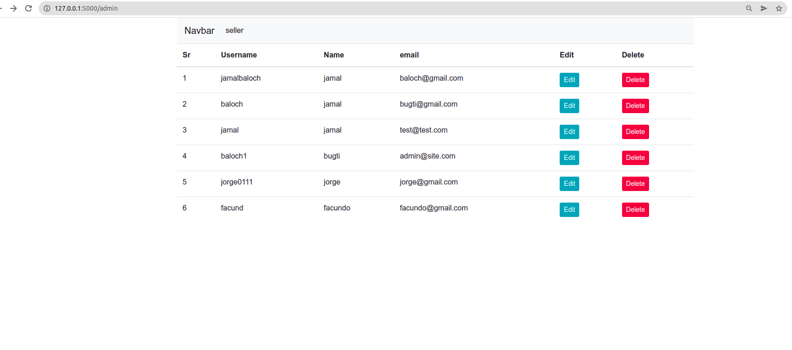

# system-ecommerce

this is a system ecommerce con python 


### Installation

```
git clone https://github.com/carjizo/system-ecommerce.git
cd system-ecommerce
pip install -r requirements.txt
python3 run.py
```

now you can visit <a href="http://127.0.0.1:5000/" target="_blank">http://127.0.0.1:5000/</a>

### Admin


### seller/register


### seller/login


### seller


### customers/carts


